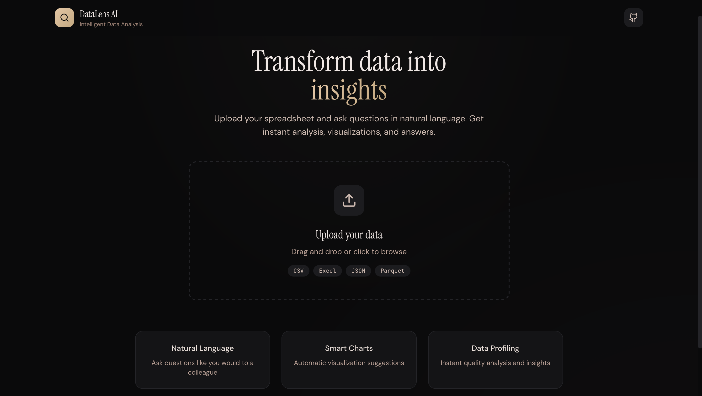

# 🔬 DataLens AI

> **Intelligent Data Analysis Platform** — Transform spreadsheets into insights using natural language

[](https://python.org)
[](https://reactjs.org)
[](https://typescriptlang.org)
[](https://fastapi.tiangolo.com)
[](LICENSE)

<p align="center">
  
</p>

## ✨ Features

### 🗣️ Natural Language Queries
Ask questions in plain English or Swedish — DataLens understands context and generates precise analysis.

```
"What was the average revenue per region in Q3?"
"Show me a trend of sales over the last 12 months"
"Which products have the highest return rate?"
```

### 📊 Smart Visualizations
Automatic chart generation based on your data structure. Interactive, customizable, and export-ready.

- Line, bar, area, and scatter charts
- Heatmaps and correlation matrices
- Distribution histograms
- Custom color themes

### 🔍 Intelligent Data Profiling
Instant insights about your dataset before you even ask:

- Data quality scores
- Missing value detection
- Outlier identification
- Column type inference
- Statistical summaries

### 📁 Multi-Format Support
- CSV, TSV
- Excel (.xlsx, .xls)
- JSON
- Parquet

## 🚀 Quick Start

### Prerequisites

- Python 3.11+
- Node.js 18+
- pnpm (recommended) or npm

### Installation

```bash
# Clone the repository
git clone https://github.com/ss-marvin/datalens-ai.git
cd datalens-ai

# Backend setup
cd backend
python -m venv venv
source venv/bin/activate  # Windows: venv\Scripts\activate
pip install -r requirements.txt

# Frontend setup
cd ../frontend
pnpm install

# Environment variables
cp .env.example .env
# Add your API keys to .env
```

### Running Locally

```bash
# Terminal 1: Start backend
cd backend
uvicorn app.main:app --reload --port 8000

# Terminal 2: Start frontend
cd frontend
pnpm dev
```

Open [http://localhost:5173](http://localhost:5173) in your browser.

## 🏗️ Architecture

```
┌─────────────────────────────────────────────────────────────┐
│                        Frontend                              │
│  ┌─────────────┐  ┌─────────────┐  ┌─────────────────────┐  │
│  │   Upload    │  │   Query     │  │   Visualization     │  │
│  │  Component  │  │   Input     │  │     Dashboard       │  │
│  └─────────────┘  └─────────────┘  └─────────────────────┘  │
└────────────────────────────┬────────────────────────────────┘
                             │ REST API
┌────────────────────────────▼────────────────────────────────┐
│                        Backend                               │
│  ┌─────────────┐  ┌─────────────┐  ┌─────────────────────┐  │
│  │   FastAPI   │  │   Pandas    │  │    AI Service       │  │
│  │   Router    │  │   Engine    │  │  (Claude/OpenAI)    │  │
│  └─────────────┘  └─────────────┘  └─────────────────────┘  │
└─────────────────────────────────────────────────────────────┘
```

## 🛠️ Tech Stack

| Layer | Technology |
|-------|------------|
| **Frontend** | React 18, TypeScript, Tailwind CSS, Recharts, Framer Motion |
| **Backend** | Python 3.11, FastAPI, Pandas, NumPy |
| **AI** | Anthropic Claude API |
| **Build** | Vite, pnpm |

## 📖 API Reference

### Upload Dataset

```http
POST /api/upload
Content-Type: multipart/form-data

file: <your-file.csv>
```

### Query Data

```http
POST /api/query
Content-Type: application/json

{
  "session_id": "abc123",
  "query": "What is the average value of column X?"
}
```

### Get Data Profile

```http
GET /api/profile/{session_id}
```

## 🎨 Screenshots

<details>
<summary>Click to expand</summary>

### Upload Interface


### Query Interface


### Visualization Dashboard


</details>

## 🤝 Contributing

Contributions are welcome! Please read our [Contributing Guide](CONTRIBUTING.md) for details.

1. Fork the repository
2. Create your feature branch (`git checkout -b feature/amazing-feature`)
3. Commit your changes (`git commit -m 'Add amazing feature'`)
4. Push to the branch (`git push origin feature/amazing-feature`)
5. Open a Pull Request

## 📄 License

This project is licensed under the MIT License — see the [LICENSE](LICENSE) file for details.

## 🙏 Acknowledgments

- [Anthropic](https://anthropic.com) for the Claude API
- [Pandas](https://pandas.pydata.org) for data manipulation
- [Recharts](https://recharts.org) for beautiful charts

---

<p align="center">
  Built with ☕ and curiosity by <a href="https://github.com/yourusername">Marvin</a>
</p>
